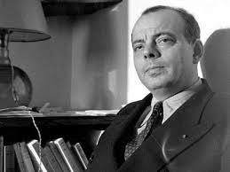
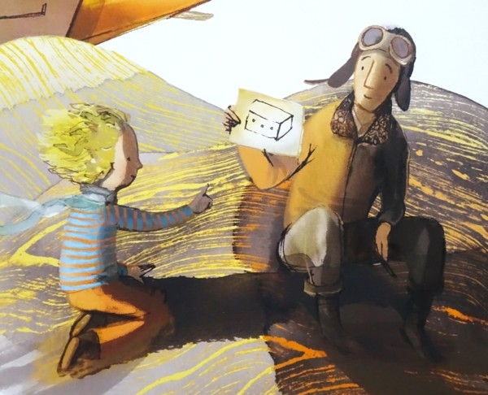
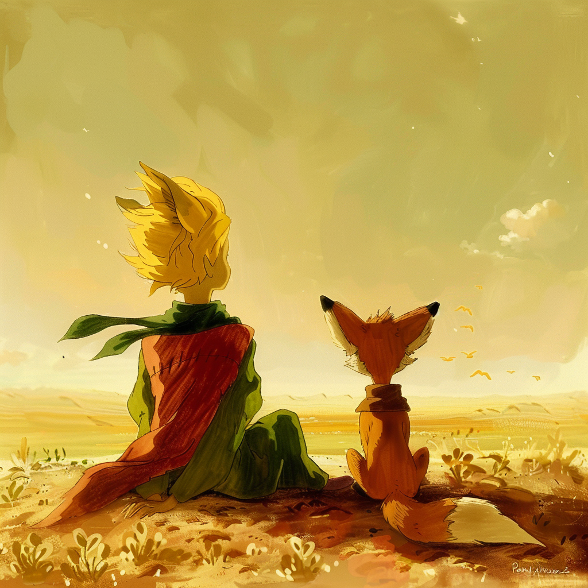

## 《小王子》

> 所有的大人都曾经是小孩，虽然，只有少数的人记得。

## 关于作者

安托万·德·圣埃克苏佩里于1900年6月29日出生在法国里昂，1944年7月31日在地中海上空执行飞行侦察任务时失踪，享年44岁。他不仅是法国作家，还是一位飞行员和诗人。作为法国最早的一代飞行员之一，他的作品多围绕飞行员生活展开。

圣埃克苏佩里的作品丰富多样，代表作有小说《夜航》，散文集《人的大地》、《空军飞行员》，以及广为人知的童话《小王子》等。这些作品不仅展现了他的文学才华，也深刻反映了他对人生、文明和飞行事业的独特见解。

圣埃克苏佩里的作品充满了对人生、文明和自然的深刻思考。他善于以飞行员的视角观察世界，用简洁而富有哲理的语言表达对生活的独特见解。

## 主要内容

《小王子》是圣埃克苏佩里最为著名的作品之一，该书于1942年写成，1943年初版发行。这部儿童文学短篇小说以其深刻的哲理性和独特的叙事风格赢得了全球读者的喜爱，至今已被译成多种语言，并改编成动画、电影、舞台剧等多种形式。在《小王子》中，他以小王子的孩子式眼光透视出成人的空虚、盲目、愚妄和死板教条，用浅显天真的语言写出了人类的孤独寂寞、没有根基随风流浪的命运。

同时，也表达出作者对金钱关系的批判和对真善美的讴歌。该书被誉为世界文学经典之一。尽管它被归类为儿童文学，但其主题和故事情节深受成人读者的喜爱和思考。

### 1、主要内容：

故事背景：故事以一位飞行员的叙述展开，他因飞机故障迫降在撒哈拉沙漠，在那里遇到了来自外星球的小王子。

主要人物：

- 小王子：来自一颗名为B-612的小行星，拥有一颗纯真而敏感的心。

- 飞行员：故事的叙述者，与小王子在沙漠中相遇，成为朋友。

### 2、故事情节

1. **离开家园:** 小王子因与自己星球上的一朵玫瑰发生争执，决定离开家园，进行星际旅行，以寻找真正的友谊和人生的意义。
   
2. **星际旅行：** 小王子先后访问了六个星球，遇到了形形色色的人，包括自负的国王、爱慕虚荣的人、酒鬼、商人、点灯人和地理学家。这些人物各自代表了人性中的不同弱点和社会问题，让小王子深感困惑和不解。
   
3. **地球之旅：** 最后，小王子来到地球，降落在撒哈拉沙漠。在这里，他遇到了蛇、狐狸等生物，并与飞行员建立了深厚的友谊。通过与狐狸的交流，小王子学会了驯化的意义，即建立深厚的情感联系，使彼此变得独一无二。

- 
   
4. **回归与牺牲：** 小王子意识到自己对玫瑰的思念和责任感，决定在蛇的帮助下返回自己的星球。最终，他以肉体死亡的方式抛弃了沉重的肉身，但灵魂却回到了自己的星球，去照料那朵独一无二的玫瑰。

- 

### 3、主体思想

- 爱与责任：小王子与玫瑰之间的关系深刻体现了爱与责任的主题。小王子离开玫瑰是为了探索世界，但最终意识到自己对玫瑰的爱和责任是无法割舍的。
- 纯真与成长：小王子以孩子的视角审视成人世界，展现了成人世界的荒谬和虚伪。同时，他也在旅途中逐渐成长，学会了珍惜和感恩。
- 孤独与友谊：小王子在星际旅行中感到孤独，但通过与飞行员等人物的交流，他体验到了友谊的温暖和重要性。
- 人性与社会：书中的人物形象各具特色，反映了人性中的不同弱点和社会问题。小王子的旅行不仅是对宇宙的探索，更是对人性和社会的深刻反思。

##  经典语录

只有用心灵才能看得清事物本质，真正重要的东西是肉眼无法看见的。

如果你驯养了我，我们就会彼此需要。对我来说，你就是我的世界里独一无二的了；我对你来说，也是你的世界里的唯一了。

一旦你驯服了什么，就要对她负责，永远的负责。

人在哪里呢？沙漠里有点寂寞。 人多的地方也很寂寞。

所有的大人都曾经是小孩，虽然，只有少数的人记得。

星星对不同的人来说有不同的意义。

眼睛往往是盲从的，人还是要用心灵去看。

重要的东西，眼睛是看不见的，就像花一样。

如果你要驯服一个人，就要冒着掉眼泪的危险。

生活才不是生命荒唐的编号，生活的意义在于生活本身。

使沙漠显得美丽的，是它在什么地方藏着一口水井。

语言是误解的根源。